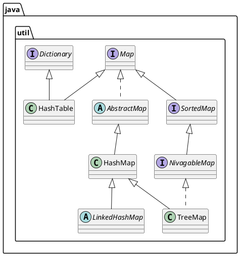

- [HashMap升级](#hashmap升级)
  - [hashmap基础](#hashmap基础)
    - [数组(array)](#数组array)
    - [链表](#链表)
    - [哈希表(HashMap)](#哈希表hashmap)
      - [HashMap继承体系](#hashmap继承体系)
      - [Map.put过程](#mapput过程)
      - [HashMap碰撞](#hashmap碰撞)
  - [HashMap底层存储结构调整](#hashmap底层存储结构调整)
- [lambda表达式](#lambda表达式)
  - [Basic](#basic)
    - [匿名内部类(Anonymous classes)](#匿名内部类anonymous-classes)
    - [什么是lambda表达式?](#什么是lambda表达式)
    - [lambda示例](#lambda示例)
  - [lambda基础语法](#lambda基础语法)
    - ["->"/箭头操作符/lambda操作符](#-箭头操作符lambda操作符)
      - [语法格式一](#语法格式一)
      - [语法格式二](#语法格式二)
      - [语法格式三](#语法格式三)
      - [语法格式四](#语法格式四)
      - [语法格式五](#语法格式五)
    - [lambda表达式需要函数式接口支持](#lambda表达式需要函数式接口支持)
- [Stream API](#stream-api)
  - [collector](#collector)
- [并行流](#并行流)
  - [Fork/Join框架](#forkjoin框架)

# HashMap升级
## hashmap基础
### 数组(array)
```
int[] array = new int[5];
//初始化定长数组
int[] array1 = new int[5] { 1, 3, 5, 7, 9 }; 
//初始化不定长数组
int[] array2 = {1,3,5,7,9};
//二维数组
int[,] numbers = new int[3, 2] { {1, 2}, {3, 4}, {5, 6} };
```

### 链表
TODO

### 哈希表(HashMap)
#### HashMap继承体系

#### Map.put过程
1. map.put(k,v)
2. 获取key的Hash值
3. 经过Hash值扰动函数，使Hash值更散列
4. 构造Node对象
5. 路由算法，找到node应存放在数组的位置

#### HashMap碰撞
不同(K,v)路由寻址得到的index地址相同，产生链表
## HashMap底层存储结构调整
数组+链表+二叉树
链表长度达到8时生成红黑树

# lambda表达式
## Basic
### 匿名内部类(Anonymous classes)
```java

```
### 什么是lambda表达式?
lambda是一个匿名函数

### lambda示例
```java
public class TestLambda {
    public static void main(String[] args) {
        ArrayList<Users> ary = new ArrayList<Users>();
        ary.add(new Users("a1",8,999.99));
        ary.add(new Users("b2",12,1999.99));
        ary.add(new Users("c2",18,9999.99));
        System.out.println(ary);
        ArrayList out1 = new ArrayList();
        //传统做法
        System.out.println("f1(ary)="+f1(ary));
        //lamda表达式
        ary.stream()
                .filter((f2) -> f2.getAge() >= 10)
                .forEach(System.out::println);
    }
    private  static ArrayList<Users> f1(ArrayList<Users> l1) {
        ArrayList<Users> r1 = new ArrayList();
        for (Users i:l1){
            if (i.getAge()>10){
                r1.add(i);
            }
        }
        return r1 ;
    }
}
```

## lambda基础语法
### "->"/箭头操作符/lambda操作符
左侧:lambda表达式参数列表
右侧:lambda体，表达式所需要执行的功能
#### 语法格式一
无参数，无返回值
```java
Runnable r1 = () -> System.out.println("Hello World");
r1.run();
```
#### 语法格式二
只有一个参数，小括号可以省略
```java
Consumer<String> r2 = x -> System.out.println(x);
r2.accept("Hello World");
```
#### 语法格式三
多个参数，且lambda体多条语句
```java
Comparator<Integer> r3 = (x, y) -> {
    System.out.println(Integer.compare(x, y));
    return Integer.compare(x, y);
};
r3.compare(3,4);
```
#### 语法格式四
只有一条语句，可以省略大括号和return
```java
Comparator<Integer> r4 = (x, y) ->  Integer.compare(x, y);
```
#### 语法格式五
lambda表达式的参数列表的数据类型可以省略不写，JVM编译器做类型推断
```java
Comparator<Integer> r5 = (x, y) ->  Integer.compare(x, y);
Comparator<Integer> r6 = (Integar x, Integar y) ->  Integer.compare(x, y);
```

### lambda表达式需要函数式接口支持
函数式接口:接口中只有一个抽象方法
使用@FunctionalInterface修饰，可以检查是否为函数式接口


# Stream API
##　概念
Stream不储存元素，不改变源对象，返回一个新的Stream

## collector

# 并行流
## Fork/Join框架
工作窃取模式
当线程获取不到任务时，会随机找一个线程队列末尾窃取一个任务执行